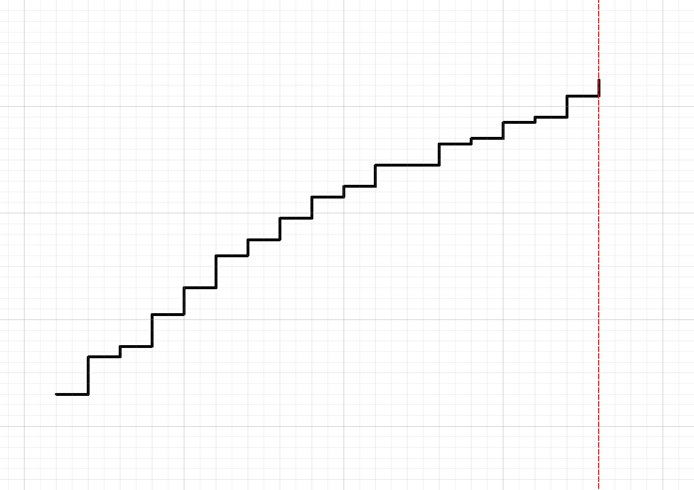
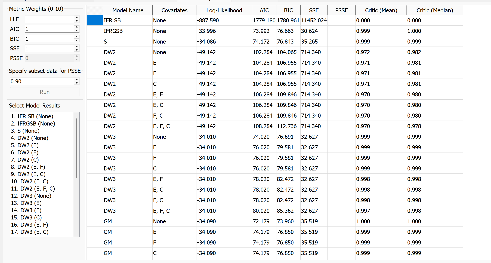
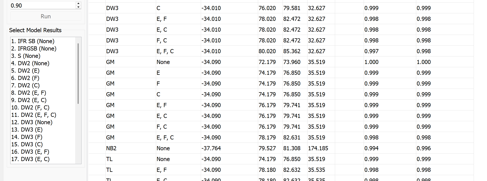
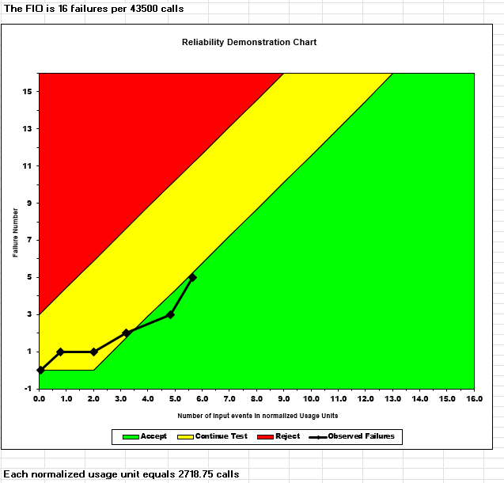
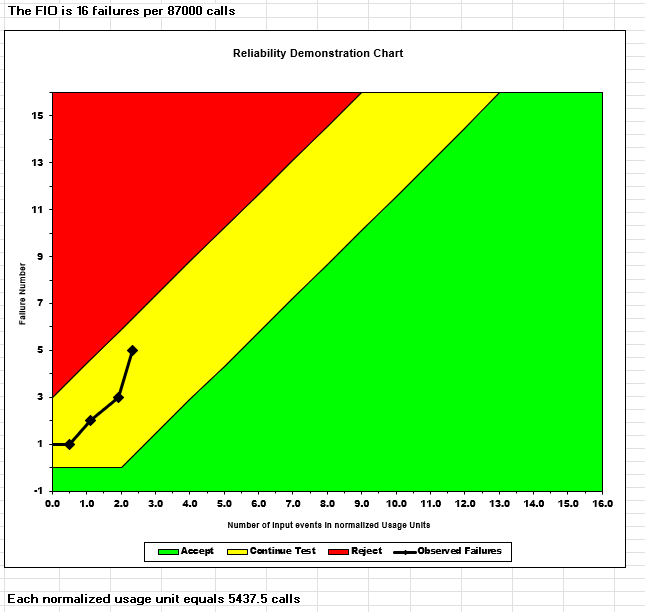
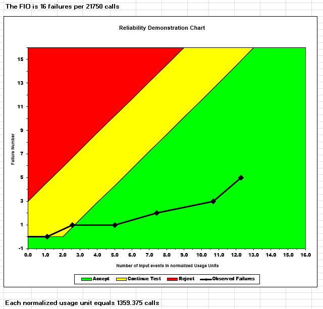

**SENG 438- Software Testing, Reliability, and Quality**

**Lab. Report \#5 – Software Reliability Assessment**

| Group \#:  9    |
| -------------- |
| Josral Frederick |
| Amielle El Makhzoumi |
| Fatma Alzubaidi | 
| Faris Janjua | 
| Erioluwa Olubadejo | 

# Introduction

# 

# Assessment Using Reliability Growth Testing 
1. Reliability growth testing is a process where a system is tested over time and failures are identified and fixed. As testing progresses, the failure rate decreases and system reliability increases. Reliability growth models are used to estimate failure intensity, reliability, and mean time to failure based on observed failure data.

2. Data preparation:The provided dataset (Failure Report 2) contains raw failure logs with failure times in seconds. However, C-SFRAT requires interval-based input data. Therefore, preprocessing was performed.

First, the failure times were extracted and converted from seconds to minutes. Then, the time was divided into 1-hour intervals (60 minutes each). Each failure was assigned to its corresponding interval, and the number of failures (FC) per interval was computed.

Since effort-related variables (E, F, C) were not provided, constant values of 1 were assumed for each interval.
The final dataset was structured as follows:
| T  | FC | E | F | C |
|----|----|---|---|---|
| 1  | 6  | 1 | 1 | 1 |
| 2  | 7  | 1 | 1 | 1 |
| 3  | 2  | 1 | 1 | 1 |
| 4  | 6  | 1 | 1 | 1 |
| 5  | 5  | 1 | 1 | 1 |
| 6  | 6  | 1 | 1 | 1 |
| 7  | 3  | 1 | 1 | 1 |
| 8  | 4  | 1 | 1 | 1 |
| 9  | 4  | 1 | 1 | 1 |
| 10 | 2  | 1 | 1 | 1 |
| 11 | 4  | 1 | 1 | 1 |
| 12 | 0  | 1 | 1 | 1 |
| 13 | 4  | 1 | 1 | 1 |
| 14 | 1  | 1 | 1 | 1 |
| 15 | 3  | 1 | 1 | 1 |
| 16 | 1  | 1 | 1 | 1 |
| 17 | 4  | 1 | 1 | 1 |
| 18 | 3  | 1 | 1 | 1 |

3. Model comparison: The processed dataset was analyzed in C-SFRAT using the baseline setting with covariates set to None. The candidate models were compared using AIC, BIC, and SSE. Based on the model comparison results, the two strongest models were GM and IFRGSB. GM was selected as the best overall model because it had the lowest AIC and BIC values, while IFRGSB was selected as the second-best model because it had the second lowest AIC and BIC values. Therefore, GM and IFRGSB were chosen as the top two models for the reliability growth analysis of Failure Report 2.

The results indicate that the system exhibits reliability growth, as the failure intensity decreases over time. This suggests that faults are being effectively identified and removed during testing. As a result, the system becomes more stable and reliable as testing progresses.

4. Model estimation results: The failure intensity plot shows a decreasing trend, indicating that the system reliability improves as testing progresses. The reliability curve shows an increasing probability of failure free operation over time. The mean time to failure (MTTF) also increases, indicating that failures occur less frequently as faults are removed.

In conclusion, the GM model provided the best fit for the failure data and demonstrated clear reliability growth. The analysis showed that the system's reliability improves as testing progresses. Overall, the system shows promising reliability improvement trends.

5. Range analysis: For Failure Report 2, the full interval range from 1 to 18 was retained for the reliability growth analysis. The failure counts vary across the intervals, but there is no clearly isolated startup only region or obviously invalid portion of the dataset that should be removed before model fitting. Although the trend is not perfectly smooth, the full range still provides a reasonable basis for comparing candidate models and evaluating the overall reliability growth behavior of the system.

6. Decision making given a target failure rate: Reliability growth analysis can support release or testing decisions by showing whether the observed failure behavior is moving toward an acceptable failure level. In the early intervals of Failure Report 2, the system experiences higher and more variable failure counts, which suggests that the software would not yet be ready if a low target failure rate were required. However, later intervals generally show lower and more stable failure counts, indicating that the system is improving as faults are found and removed. Therefore, if a target failure rate were specified, the decision would depend on whether the most recent failure behavior is low enough to satisfy that target. In this case, the results suggest that the system is improving, but it would still be important to compare the later stage failure behavior against the required reliability threshold before deciding that testing can stop or that the system is ready for release.

7. Advantages and disadvantages of reliability growth analysis: One advantage of reliability growth analysis is that it uses observed failure data over time to show whether the system is improving as testing progresses. It also allows different models to be compared, which helps identify the model that best explains the failure behavior of the system. In addition, it can support decisions about software readiness by showing trends in failure intensity, reliability, and mean time to failure. However, reliability growth analysis also has limitations. It depends on the quality of the collected failure data and on how well the selected model fits the data. The results can also be affected by preprocessing choices, such as interval selection or assumptions made for missing effort variables. As a result, although reliability growth analysis is useful for understanding failure trends, its conclusions should still be interpreted carefully.

# Assessment Using Reliability Demonstration Chart 

The Reliability Demonstration Chart (RDC) is used to evaluate whether the system under test (SUT) meets a specified reliability requirement in terms of Mean Time To Failure (MTTF). In the RDC, the vertical axis represents the cumulative number of failures (n), while the horizontal axis represents the normalized failure time (Tn​/MTTF). By plotting observed failure data on this chart, it is possible to determine whether the system falls within the Accept, Continue Test, or Reject regions under the chosen risk parameters.

For Part 2, we used the same dataset as Part 1 (Failure Report 2), which contains 65 failures recorded over a total test time of 64,542 seconds (around 17.9 hours). 

The RDC-11 tool accepts individual failure times as input, with a maximum of 16 data points. Since our dataset contains 65 failures, we selected 16 evenly spaced representative failure observations to capture the overall trend of the data. This approach preserves the distribution of failures across the entire testing duration while avoiding bias toward any specific portion of the dataset.

Our selected failure times were as indicated below.

| Observation | Cumulative Failure Time (s) |
|---|---|
| 1 | 524 |
| 2 | 2,855 |
| 3 | 4,852 |
| 4 | 8,171 |
| 5 | 11,468 |
| 6 | 15,866 |
| 7 | 18,047 |
| 8 | 19,989 |
| 9 | 24,314 |
| 10 | 28,024 |
| 11 | 34,882 |
| 12 | 37,705 |
| 13 | 44,580 |
| 14 | 52,798 |
| 15 | 58,762 |
| 16 | 64,542 |

The risk parameters were unchanged from their standard values. The Failure Intensity Objective (FIO) was adjusted by changing the "Per Number of Input Events" cell which controls the MTTF used for normalization. We calculated the normalized failure time (Tn) for each observation as:

    Tn = Failure Time × (Max Failures / Per Number of Input Events)
 *This formula normalizes the failure times relative to the target MTTF, allowing the data to be plotted on the RDC.
  By converting raw failure times into normalized values, the chart can consistently evaluate whether the observed failures meet the specified          reliability requirement.*

MTTFmin represents the largest MTTF value for which the system is still considered acceptable. This means that any increase beyond this value causes the failure points to move into the Continue Test or Reject regions, meaning the system no longer satisfies the reliability requirement. To determine this, we iteratively adjusted the "Per Number of Input Events" value until the last plotted point fell just within the Accept boundary. This occurred at:

- Per Number of Input Events = 43,500
- MTTFmin = 43,500 / 16 = 2,718.75 seconds = 0.755 hours

At this setting, the last failure point lands at approximately (5.5, 5) on the chart, which is just inside the green Accept region. This confirms tht it is the minimum acceptable MTTF.

## 3 Plots for MTTFmin, Twice MTTFmin, and Half MTTFmin

### Plot 1 - MTTFmin (Per Input Events = 43,500, MTTF = 2,719 seconds)

At MTTFmin, the failure points gradually move from the lower left toward the Accept region. The last point falls just inside the Accept boundary which indicates the SUT marginally meets the minimum reliability requirement. This is the minimum MTTF where we can consider the system acceptable given our risk parameters.

### Plot 2 — 2× MTTFmin (Per Input Events = 87,000, MTTF = 5,438 seconds)

When the target MTTF is doubled to approximately 5,438 seconds, the failure points shift to the left on the chart and fall inside the yellow Continue Test region. This means the SUT does not meet this stricter reliability requirement. More testing and development would be needed before the system could be accepted at this higher MTTF target.

### Plot 3 — 0.5× MTTFmin (Per Input Events = 21,750, MTTF = 1,359 seconds)

When the target MTTF is halved to around 1,359 seconds, the failure points shift far to the right and fall deep inside the green Accept region. This confirms that the SUT comfortably meets this more relaxed reliability target, with significant margin to spare.

---

As mentioned, MTTFmin was determined through iterative experimentation with the FIO value in the Failure Data Tab. We first started with an initial estimate based on average inter-failure time (64,542s / 16 points = 4,034 seconds). Then, we had to adjust the "Per Number of Input Events" cell up or down and observe where the last plotted point landed on the chart. Finally, we settled on E3 = 43,500 when the last point just crossed into the Accept region.

The key insight is that the normalized failure time Tn = failure time / MTTF. A larger MTTF means smaller Tn values, which pushes points left (harder to accept). A smaller MTTF means larger Tn values, pushing points right (easier to accept). MTTFmin is therefore the largest MTTF where the system is still considered acceptable.

At MTTFmin = 2,719 seconds, the system experiences one failure every 45 minutes of operation on average. The RDC confirms this is the boundary reliability level. Below this, the system is acceptable and above this, more testing is required.

## Advantages and Disadvantages of RDC

Advantages:
- Time and cost efficient because it requires only a small number of failure observations to produce a meaningful reliability assessment
- Visually intuitive since the three zones in the chart (Accept/Continue/Reject) makes decision-making straightforward even for new users like us
- Supports what-if analysis which made experimenting with different MTTF targets simple and fast and required only changing a single cell 
- Works well with limited data unlike reliability growth models 

Disadvantages:
- Can not calculate exact quantitative reliability values since RDC only indicates whether the SUT is acceptable, not by how much
- Limited to 16 data points which means it requires subsampling for larger datasets which can lose information
- Does not model the growth or improvement of reliability over time since it is a snapshot assessment, not a trend analysis

# Comparison of Results

# Discussion on Similarity and Differences of the Two Techniques

# How the team work/effort was divided and managed

# 

# Difficulties encountered, challenges overcome, and lessons learned

## For RDC tool

One of the main challenges we encountered in this lab was understanding how the RDC-11 tool actually works in practice. The lab instructions were vague about how to correctly input failure data into the Excel sheet, and it was not clear what each column represented or how the normalization worked. In particular, understanding the relationship between the "Per Number of Input Events" cell and the resulting MTTF took significant trial and error to figure out.

# Comments/feedback on the lab itself
